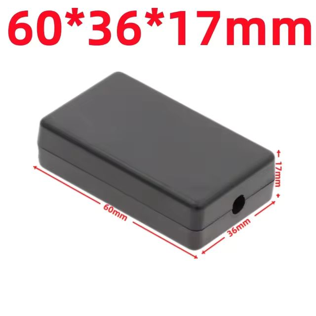
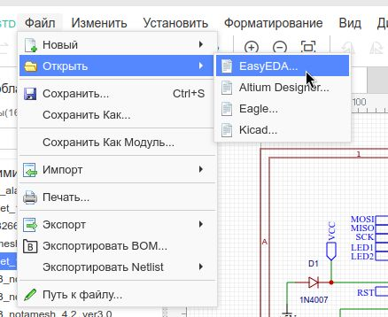

В папке **pcb** лежат следующие файлы:

- **Schematic.png** - схема модуля;
- **pcb.jpg** - рисунок двусторонней платы; плата имеет размер `30,23x54,86 mm` и спроектирована под такую коробочку:

- **christmas-garland_easyeda.json** - файл проекта EasyEDA, если вам вдруг понадобится внести изменения в схему или плату; загрузка проекта в EasyEDA (если вдруг кто не знает )):

- **christmas-garland_gerber_ver3.0.zip** - Gerber-файл для заказа у китайцев